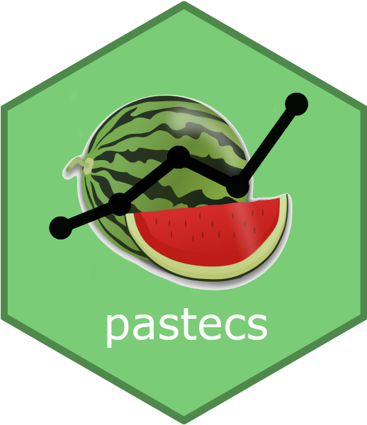

<!-- README.md is generated from README.Rmd. Please edit that file -->

# Package for Analysis of Space-Time Ecological Series <a href="https://www.sciviews.org/pastecs"></a>

<!-- badges: start -->

[](https://github.com/SciViews/pastecs/actions/workflows/R-CMD-check.yaml)
[](https://codecov.io/gh/SciViews/pastecs)
[](https://cran.r-project.org/package=pastecs)
[](https://sciviews.r-universe.dev/pastecs)
[](https://www.gnu.org/licenses/gpl-2.0.html)
[](https://www.tidyverse.org/lifecycle/#stable)
<!-- badges: end -->

**PASTECS** stands for **package for the analysis of space-time
ecological series**. It allows to transform an irregular time series
into a regular one, and to analyze and decompose regular time series. It
provides various S3 objects to ease the manipulation of time series.

Install the CRAN version using:

``` r
install.packages("pastecs")
```

## Code of Conduct

Please note that the {pastecs} package is released with a [Contributor
Code of
Conduct](https://contributor-covenant.org/version/2/1/CODE_OF_CONDUCT.html).
By contributing to this project, you agree to abide by its terms.
